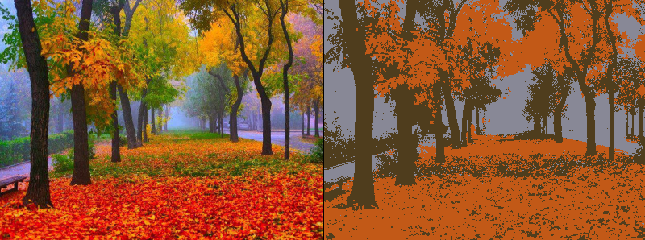

## Godot ImageTools

This is a Godot module aimed to simplify and optimize various operations that can
be performed on an image. Currently you'll find the following classes for image
manipulation:

* `ImageIndexed`
     * adds pseudo support for indexed images with a color palette.


### Thirdparty libraries:
The module uses [exoquant](https://github.com/exoticorn/exoquant) library for image quantization which is under MIT license.

## Use cases and examples

* Taking a screenshot and reducing number of colors to optimize for size:
```gdscript
func save_screenshot():
	get_viewport().render_target_v_flip = true # hmm
	yield(VisualServer, "frame_post_draw")
	get_viewport().render_target_v_flip = false

	screenshot.convert(Image.FORMAT_RGBA8)
	screenshot.generate_palette()
	screenshot.save_png("screenshot_indexed.png")
```

* Finding dominant/average colors in an image:
```gdscript
image.generate_palette(2) # first color is usually background
var dominant_color = image.get_palette_color(1)
# or...
image.generate_palette(8)
var average_colors = image.get_palette()
```


* Image posterization? (8-bit feel):
```gdscript
var image = get_node('sprite').texture.get_data()
image.generate_palette(8)
image.apply_palette()
```



* [Palette swapping](https://github.com/HeartoLazor/godot_palette_swap)
```gdscript
var image = get_node('sprite').texture.get_data()
if not image.has_palette():
     image.generate_palette(16)

image.set_palette_color(5, Color.red)
image.set_palette_color(9, Color.gold)
image.set_palette_color(1, Color.darkred)

image.apply_palette()
```

